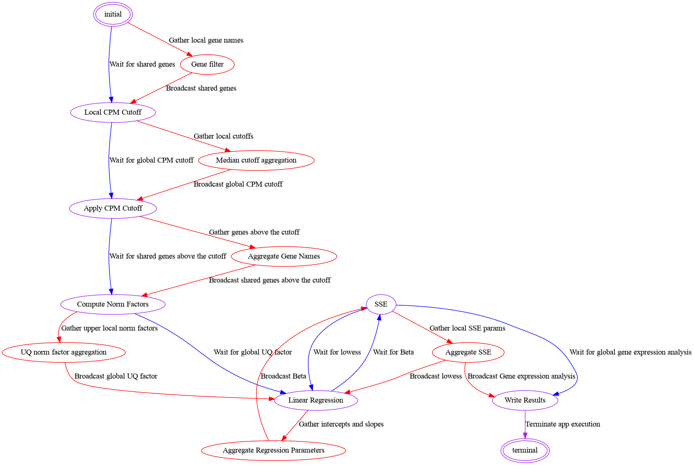

## [FeatureCloud Flimma app](https://featurecloud.ai/app/flimma)
### Federated version of state of the art Limma Voom application
<p><b>Flimma</b> is a federated privacy-aware version of state-of-the art differential expression analysis method <a href="https://bioconductor.org/packages/release/bioc/html/limma.html"><i><b>limma voom</b></i></a>.</p> 
   <p>Publiation: <a href="https://genomebiology.biomedcentral.com/articles/10.1186/s13059-021-02553-2"<i><b> BMC Genome Biology (2021)</b></i></a>.</p> 
   
   <p><b>FeatureCloud Flimma app</b> is implemented based on <a href="https://exbio.wzw.tum.de/flimma/"<i>exbio.wzw.tum.de/flimma/</i></a></p> 



### Config

```angular2html
flimma:
  local_dataset:
    counts: counts.tsv
    design: design.tsv
  logic:
    mode: file
    dir: .
  axis: 0
  use_smpc: false
  normalization: upper quartile
  min_count: 10
  min_total_count: 15
  group1: Lum
  group2: Basal
  confounders: diagnosis_age,stage
  result:
    table: results.csv
    volcano: volcano
```

### Run Flimma
#### Prerequisite
To run the Flimma application you should install Docker and featurecloud pip package:
```shell 
pip install featurecloud
```
Then either download the Flimma image from featurecloud docker repository:
```shell
featurecloud app download featurecloud.ai/flimma 
```
Or build the app locally:
```shell
featurecloud app build featurecloud.ai/fc_flimma 
```
You can use provided example data or you own data. And provide the desired settings in the `config.yml` file.
#### Running app
You can run Flimma as a standalone app in the [FeatureCloud test-bed](https://featurecloud.ai/development/test) or [FeatureCloud Workflow](https://featurecloud.ai/projects). You can also run the app using CLI:
```shell
featurecloud test start --app-image featurecloud.ai/flimma --client-dirs './flimma/c1,./flimma/c2,./flimma/c3' --generic-dir './flimma/generic'
```
```angular2html
@article{Zolotareva2021,
 doi = {10.1186/s13059-021-02553-2},
 url = {https://doi.org/10.1186/s13059-021-02553-2},
 year = {2021},
 month = dec,
 publisher = {Springer Science and Business Media {LLC}},
 volume = {22},
 number = {1},
 author = {Olga Zolotareva and Reza Nasirigerdeh and Julian Matschinske and Reihaneh Torkzadehmahani and Mohammad Bakhtiari and Tobias Frisch and Julian Sp\"{a}th and David B. Blumenthal and Amir Abbasinejad and Paolo Tieri and Georgios Kaissis and Daniel R\"{u}ckert and Nina K. Wenke and Markus List and Jan Baumbach},
 title = {Flimma: a federated and privacy-aware tool for differential gene expression analysis},
 journal = {Genome Biology}
}
  
@misc{nasirigerdeh2021hyfed,
       title={HyFed: A Hybrid Federated Framework for Privacy-preserving Machine Learning},
       author={Reza Nasirigerdeh and Reihaneh Torkzadehmahani and Julian Matschinske and Jan Baumbach and Daniel Rueckert and Georgios Kaissis},
       year={2021},
       eprint={2105.10545},
       archivePrefix={arXiv},
       primaryClass={cs.LG}
}
```
